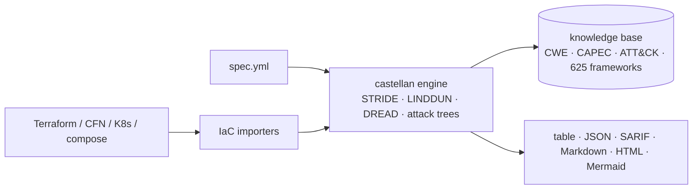

<a name="top"></a>
<div align="center">


# 🏰 castellan

### The keeper of your threat model.

*Offline, MCP-native threat modeling — STRIDE + LINDDUN models, DREAD-scored risk, attack trees, and 600+ compliance-framework mappings, generated from a spec **or straight from your Infrastructure-as-Code**.*

[](https://pypi.org/project/cognis-castellan/) [](https://github.com/cognis-digital/castellan/actions) [](LICENSE) [](https://github.com/cognis-digital)

*Part of the Cognis Neural Suite.*

</div>

```bash
pip install cognis-castellan
castellan analyze system.yml            # full STRIDE+LINDDUN model in milliseconds
castellan scan ./infra --fail-on high   # model your Terraform/K8s and gate CI
```

---

## Why castellan?

Most threat-modeling tools are heavyweight, cloud-only SaaS that lock your architecture and findings behind an account. **castellan is the opposite:** a single, fast, dependency-free engine that runs entirely on your machine or in CI, speaks the formats your pipeline already uses, and drives from AI agents over MCP.

It ships with a large, **real** body of security knowledge — and the headline numbers below are *computed by the tool*, not asserted. Run `castellan library stats` to print them yourself.

| Metric | castellan ships | Verify |
|---|---:|---|
| 🎯 Threat scenarios | **5,000+** | `castellan library threats` |
| 📋 Security requirements | **12,000+** | `castellan library requirements` |
| 🏛️ Compliance frameworks mapped | **625** | `castellan library frameworks` |
| 🧩 Base attack patterns | **98** | each tied to CWE/CAPEC/ATT&CK/OWASP |
| 🗂️ Asset classes | **87** | real component taxonomy |
| 🔬 Methodologies | **6** | STRIDE · LINDDUN · DREAD · CIA · PASTA-style risk · Attack Trees |

<div align="right"><a href="#top">↑ back to top</a></div>

## What it does

- **STRIDE** threat modeling from a tiny YAML system spec (elements + data flows + trust boundaries).
- **LINDDUN** privacy threats for any element or flow that touches personal data.
- **DREAD risk scoring** — every threat gets reproducible 0–10 risk, a level, and CIA impact, derived from structural facts (exposure, trust-boundary crossing, declared controls).
- **Attack trees** per process and datastore.
- **Real references** on every threat: CWE, CAPEC, MITRE ATT&CK techniques, OWASP Top 10 / API Top 10.
- **Compliance control matrix** — each threat maps to concrete controls across NIST 800-53, ISO/IEC 27001:2022, PCI DSS v4, OWASP ASVS, CIS Controls v8, SOC 2, GDPR, ISO 27701 and more.
- **Infrastructure-as-Code in, threat model out** — point it at Terraform, CloudFormation, Kubernetes manifests, or docker-compose and it derives the model automatically.
- **MCP-native** — `castellan mcp` exposes the whole engine as tools for Claude Desktop, Cursor, Cognis.Studio, and agent fleets.

<div align="right"><a href="#top">↑ back to top</a></div>

## Quick start

```bash
pip install cognis-castellan

castellan analyze system.yml                       # human table
castellan analyze system.yml --format json         # machine-readable
castellan analyze system.yml --format sarif        # code-scanning
castellan analyze system.yml --format html -o tm.html   # shareable report
castellan analyze system.yml --fail-on high        # CI gate (non-zero exit)

castellan scan ./infra                             # auto-detect spec OR IaC
castellan import ./infra > system.yml              # convert IaC to a spec you can edit
castellan compliance system.yml                    # the control matrix
castellan library stats                            # the numbers above, computed
```

### The spec format

```yaml
name: Acme Web Application
elements:
  - name: user
    type: external_entity
  - name: web-api
    type: process
    controls: [mfa, rate-limit]      # declared controls mark threats mitigated
  - name: user-db
    type: datastore
    data_classification: pii         # turns on LINDDUN privacy threats
flows:
  - name: login
    from: user
    to: web-api
    encrypted: true
    crosses_boundary: true
```

```text
$ castellan analyze webapp.yml
System: Acme Web Application
Threats: 21  Unmitigated: 14  Risk score: 9.0/10  Frameworks: 7
Methodologies: STRIDE:21

ID         RISK  SEVERITY  METH     CATEGORY                 M  TARGET
T017-I     9.3   critical  STRIDE   Information Disclosure   -  db-query
T020-E     8.0   critical  STRIDE   Elevation of Privilege   -  web-api
...
```

<div align="right"><a href="#top">↑ back to top</a></div>

## From your Infrastructure-as-Code

No diagram to draw — model what you actually deploy:

```bash
castellan scan main.tf                  # Terraform (HCL or plan JSON)
castellan scan template.yaml            # CloudFormation
castellan scan k8s/                     # Kubernetes manifests
castellan scan docker-compose.yml       # docker-compose
castellan scan ./infra --fail-on high   # a whole repo, merged into one model
```

castellan classifies each resource onto its asset taxonomy, flags encryption and public-exposure gaps, synthesizes trust edges, and runs the full engine over the result.

<div align="right"><a href="#top">↑ back to top</a></div>

## Use it from any AI stack

`castellan` is interoperable with every popular way of using AI:

- **MCP server** — `castellan mcp` exposes `analyze`, `scan`, `validate`, `import_iac`, `compliance`, `report_markdown`, and `library_stats` as tools (Claude Desktop, Cursor, Cognis.Studio, [uncensored-fleet](https://github.com/cognis-digital/uncensored-fleet)).
- **JSON / SARIF** — pipe `--format json` or `--format sarif` into any agent, LLM, or code-scanning UI.
- **LangChain · CrewAI · AutoGen · LlamaIndex** — wrap the CLI/JSON as a tool in one line.
- **CI / scripts** — exit codes + SARIF for non-AI pipelines.

<div align="right"><a href="#top">↑ back to top</a></div>

## How it compares

|  | **castellan** | typical commercial platforms |
|---|:---:|:---:|
| Runs fully offline / self-hosted | ✅ | ❌ (cloud SaaS) |
| No account, no per-seat license | ✅ | ❌ |
| STRIDE + LINDDUN privacy | ✅ | partial |
| DREAD risk + attack trees | ✅ | varies |
| Threat-models your IaC directly | ✅ Terraform/CFN/K8s/compose | varies |
| MCP-native for AI agents | ✅ | rare |
| JSON + SARIF for CI | ✅ | varies |
| Compliance frameworks mapped | ✅ **625** | varies |
| Open, auditable knowledge base | ✅ | ❌ (proprietary) |
| Price | **free / COCL** | enterprise |

> Every castellan number in this table is reproducible from your own checkout via `castellan library stats`.

<div align="right"><a href="#top">↑ back to top</a></div>

## Architecture



<div align="right"><a href="#top">↑ back to top</a></div>

## Install — every way, every platform

```bash
pip install cognis-castellan                                              # PyPI
pipx install cognis-castellan                                             # isolated CLI
uv tool install cognis-castellan                                          # uv
pip install "git+https://github.com/cognis-digital/castellan.git"         # from source
docker run --rm ghcr.io/cognis-digital/castellan:latest --help            # Docker
curl -fsSL https://raw.githubusercontent.com/cognis-digital/castellan/main/install.sh | sh
```

Optional extras: `pip install "cognis-castellan[mcp]"` (MCP server), `[connect]` (forward findings via cognis-connect), `[dev]` (tests).

<div align="right"><a href="#top">↑ back to top</a></div>

## Related Cognis tools

**Explore the suite →** [🗂️ all tools](https://github.com/cognis-digital) · [🔗 cognis-connect](https://github.com/cognis-digital/cognis-connect) · [🤖 uncensored-fleet](https://github.com/cognis-digital/uncensored-fleet) · [🧠 engram](https://github.com/cognis-digital/engram)

## Contributing

PRs, new attack patterns, framework mappings, and IaC importers are welcome under the collaboration-pull model — see [CONTRIBUTING.md](CONTRIBUTING.md) and [SECURITY.md](SECURITY.md).

> ### ⭐ If `castellan` saved you time, **star it** — it genuinely helps others find it.

## License

Source-available under the **Cognis Open Collaboration License (COCL) v1.0** — free for personal, internal-evaluation, research, and educational use; **commercial / production use requires a license** (licensing@cognis.digital). See [LICENSE](LICENSE).

---

<div align="center"><sub><b><a href="https://cognis.digital">Cognis Digital</a></b> · part of the <a href="https://github.com/cognis-digital">Cognis Neural Suite</a> · <i>Making Tomorrow Better Today</i></sub></div>
